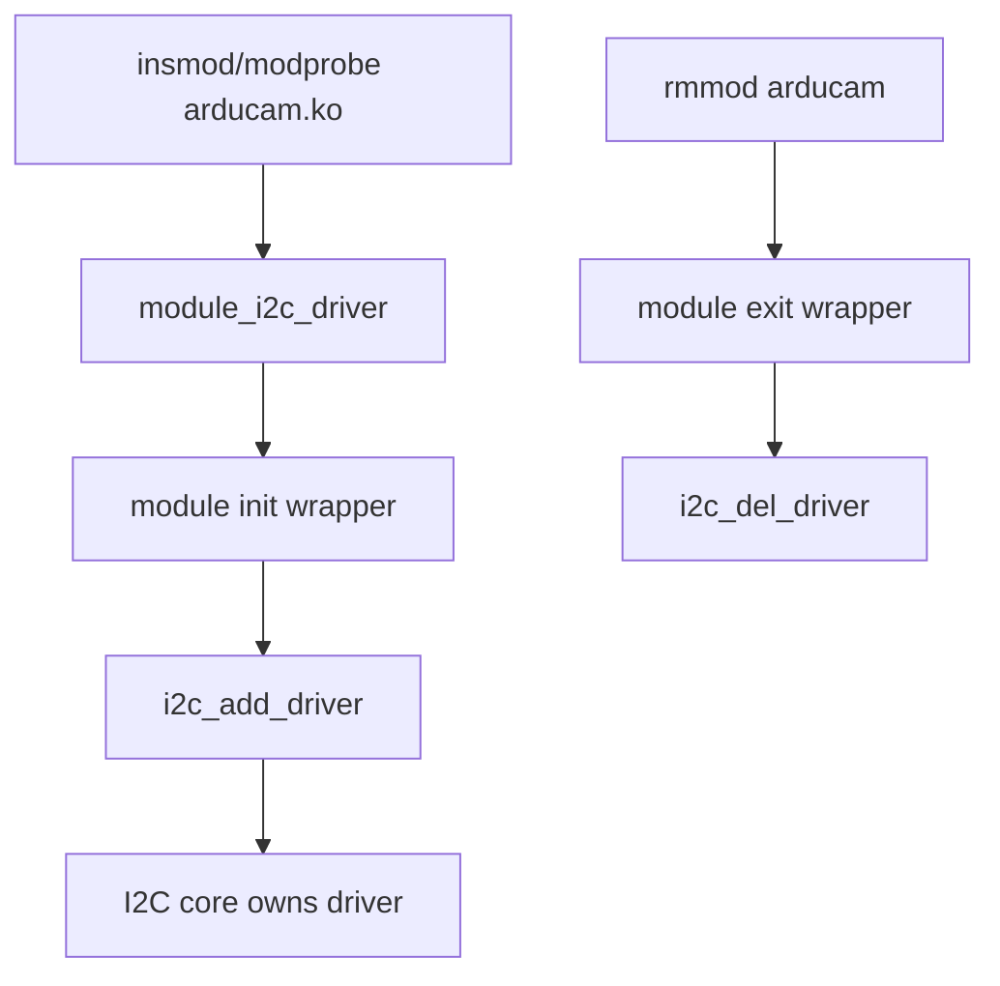
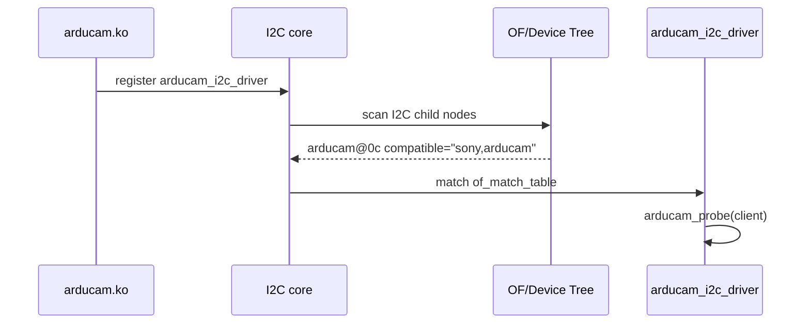
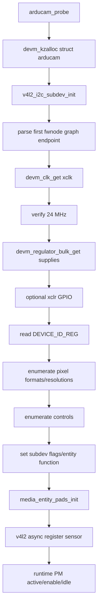
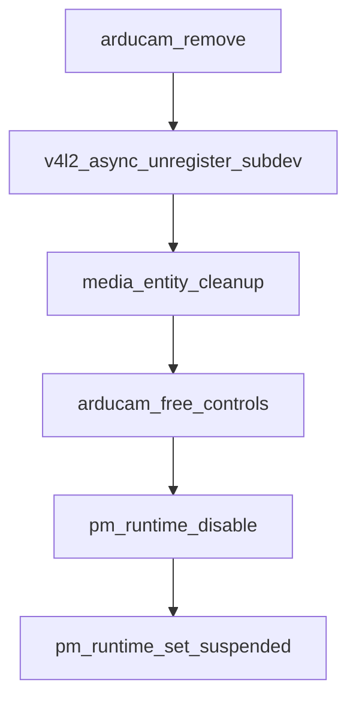

# Legacy Arducam OBISP Driver Architecture

This document describes how the legacy Arducam OBISP MIPI camera module driver is wired into the Linux I2C, V4L2 sub-device, media-controller, and Device Tree subsystems. It focuses on the driver copy in `sourceCode/arducam.c`; `sourceCode/5.4.51/arducam.c` follows the same registration model.

## High-level architecture

The OBISP module is an I2C-controlled V4L2 camera sensor sub-device. The Raspberry Pi Device Tree overlay instantiates an I2C device with `compatible = "sony,arducam"` under the camera I2C bus. The kernel matches that node against the driver's OF match table, calls `arducam_probe()`, and the probe routine registers a V4L2 sub-device plus one media source pad. The Raspberry Pi CSI-2 receiver driver consumes the graph endpoint connection from the overlay and completes the media pipeline asynchronously.

```mermaid
flowchart LR
    DT[Device Tree overlay] --> I2CNode[arducam@0c I2C node]
    I2CNode --> Match[OF match: sony,arducam]
    Match --> Probe[arducam_probe]
    Probe --> SD[V4L2 sub-device]
    Probe --> Pad[Media source pad]
    Probe --> Async[V4L2 async sensor registration]
    I2CNode --> Endpoint[Sensor endpoint]
    Endpoint <--> CSI[CSI-2 receiver endpoint]
    Async --> MediaGraph[Media controller graph]
```

## `module_init()` / module entry point

The driver does not define a handwritten `module_init()` function. Instead, it uses the kernel `module_i2c_driver(arducam_i2c_driver)` helper. That macro expands to the module initialization and exit boilerplate for an I2C driver: module load registers `arducam_i2c_driver` with the I2C core, and module unload unregisters it.



## I2C driver registration

The registered `struct i2c_driver` is named `arducam_i2c_driver`. Its `.driver.name` is `"arducam"`, its `.driver.of_match_table` points at `arducam_dt_ids`, and its callbacks are `arducam_probe` and `arducam_remove`.

The OF match table contains one sensor compatible string: `"sony,arducam"`. When the Device Tree node under the I2C bus has this compatible string, the I2C core binds it to this driver and invokes `arducam_probe()`.



## Expected Device Tree nodes

The probe path expects the matched I2C client node to provide:

- `compatible = "sony,arducam"` so the OF match table binds the node to the driver.
- `reg = <0x0c>` for the camera's I2C address as used by the supplied overlay.
- `clocks` and `clock-names = "xclk"`; the probe reads the clock and rejects anything other than 24 MHz.
- `VANA-supply`, `VDIG-supply`, and `VDDL-supply`; the driver requests these regulator supplies by name.
- An optional `xclr` GPIO. The current overlay provides a power-control GPIO through the fixed regulator rather than an `xclr-gpios` property, so the driver's `devm_gpiod_get_optional(..., "xclr", ...)` can legitimately return no GPIO.
- A graph `port` / `endpoint` child. The probe gets the first endpoint with `fwnode_graph_get_next_endpoint()` and parses it with `v4l2_fwnode_endpoint_parse()`.

Expected sensor-node shape:

```dts
arducam: arducam@0c {
    compatible = "sony,arducam";
    reg = <0x0c>;
    status = "okay";

    clocks = <&arducam_clk>;
    clock-names = "xclk";

    VANA-supply = <&arducam_vana>;
    VDIG-supply = <&arducam_vdig>;
    VDDL-supply = <&arducam_vddl>;

    rotation = <180>;

    port {
        arducam_0: endpoint {
            remote-endpoint = <&csi1_ep>;
            clock-lanes = <0>;
            data-lanes = <1 2>;
            clock-noncontinuous;
            link-frequencies = /bits/ 64 <456000000>;
        };
    };
};
```

## Expected overlay

The maintained 5.4.51 overlay is the readable source overlay. It targets Raspberry Pi camera plumbing as follows:

- Top-level platform compatibility includes `"brcm,bcm2712"`, `"brcm,bcm2711"`, and `"brcm,bcm2835"`.
- `fragment@0` targets `&i2c_csi_dsi`, enables the bus, and creates the `arducam@0c` sensor node.
- `fragment@1` targets `&csi1`, enables the CSI-2 receiver, and creates the reciprocal CSI endpoint.
- `fragment@2` enables `&i2c0if`.
- `fragment@3` creates fixed regulators for `VANA`, `VDIG`, and `VDDL`, plus a 24 MHz fixed clock.
- `fragment@4` enables `&i2c0mux`.
- `fragment@5` exposes power-down GPIO overrides under `/__overrides__`.
- The root `__overrides__` block exposes the sensor `rotation` property.

```mermaid
flowchart TB
    Root[Overlay root compatible strings]
    Root --> F0[fragment@0: &i2c_csi_dsi]
    Root --> F1[fragment@1: &csi1]
    Root --> F2[fragment@2: &i2c0if]
    Root --> F3[fragment@3: / regulators + xclk]
    Root --> F4[fragment@4: &i2c0mux]
    Root --> F5[fragment@5: /__overrides__]
    F0 --> Sensor[arducam@0c]
    Sensor --> SensorEP[arducam_0 endpoint]
    F1 --> CSIEP[csi1_ep endpoint]
    SensorEP <-- remote-endpoint --> CSIEP
    F3 --> VANA[VANA fixed regulator]
    F3 --> VDIG[VDIG fixed regulator]
    F3 --> VDDL[VDDL fixed regulator]
    F3 --> XCLK[24 MHz fixed clock]
```

## Expected compatible strings

There are two different compatible-string roles:

| Location | Compatible strings | Meaning |
| --- | --- | --- |
| Overlay root | `"brcm,bcm2712"`, `"brcm,bcm2711"`, `"brcm,bcm2835"` | Declares which Raspberry Pi SoC families the overlay can apply to. |
| Sensor I2C node | `"sony,arducam"` | Binds the I2C child node to `arducam_i2c_driver`. |
| Fixed regulators | `"regulator-fixed"` | Uses the kernel fixed-regulator provider for camera supplies. |
| Fixed clock | `"fixed-clock"` | Provides the 24 MHz `xclk` consumed by the driver. |

## `probe()` call chain

`arducam_probe()` performs all device discovery and V4L2/media registration work:

1. Allocate `struct arducam` with devm-managed memory.
2. Initialize the embedded `struct v4l2_subdev` for the I2C client with `v4l2_i2c_subdev_init()`.
3. Fetch and parse the first graph endpoint from the Device Tree node.
4. Fetch the `xclk` clock, read its rate, and require 24 MHz.
5. Request the named regulator supplies.
6. Request optional `xclr` GPIO.
7. Read `DEVICE_ID_REG` over I2C and require the firmware/device ID expected by the driver.
8. Query pixel formats and resolutions from the OBISP device registers.
9. Query controls from the OBISP device registers and create V4L2 controls.
10. Assign internal subdev ops, enable a subdev device node, and mark the media entity as a camera sensor.
11. Initialize one media source pad.
12. Register the sensor sub-device asynchronously with V4L2.
13. Enable runtime PM bookkeeping.



Failure handling is local to the point of failure. Once media pads or controls have been initialized, later failures clean those resources before returning an error.

## Video registration path

This driver is a V4L2 sub-device driver, not a standalone video-node capture driver. It exposes sensor operations and a media entity; the Raspberry Pi receiver/bridge stack is responsible for creating the capture video node once the async graph is complete.

The registration path is:

1. `v4l2_i2c_subdev_init()` associates the sub-device with the I2C client and `arducam_subdev_ops`.
2. `arducam_subdev_ops` advertises:
   - video `.s_stream` for stream on/off;
   - pad `.enum_mbus_code`, `.get_fmt`, `.set_fmt`, `.enum_frame_size`, and `.enum_frame_interval` operations;
   - internal `.open` to initialize try format state.
3. `arducam->sd.flags |= V4L2_SUBDEV_FL_HAS_DEVNODE` requests a sub-device devnode.
4. `arducam->sd.entity.function = MEDIA_ENT_F_CAM_SENSOR` identifies the entity as a camera sensor.
5. `arducam->pad.flags = MEDIA_PAD_FL_SOURCE` creates a single source pad.
6. `media_entity_pads_init()` attaches that source pad to the media entity.
7. `v4l2_async_register_subdev_sensor()` or `v4l2_async_register_subdev_sensor_common()` publishes the sub-device for async binding by the Raspberry Pi CSI-2 receiver pipeline.

```mermaid
flowchart LR
    I2CProbe[arducam_probe] --> SubdevInit[v4l2_i2c_subdev_init]
    SubdevInit --> Ops[arducam_subdev_ops]
    Ops --> VideoOps[s_stream]
    Ops --> PadOps[format/code/size/interval ops]
    I2CProbe --> Entity[MEDIA_ENT_F_CAM_SENSOR]
    Entity --> SourcePad[MEDIA_PAD_FL_SOURCE]
    SourcePad --> PadsInit[media_entity_pads_init]
    PadsInit --> AsyncReg[V4L2 async sensor registration]
    AsyncReg --> RPICSI[Raspberry Pi CSI-2 receiver]
    RPICSI --> VideoNode[/dev/video* capture node]
    AsyncReg --> SubdevNode[/dev/v4l-subdev*]
```

## Removal path

On driver removal, `arducam_remove()` unregisters the V4L2 async sub-device, cleans up the media entity, frees V4L2 controls, disables runtime PM, and marks the device suspended.


