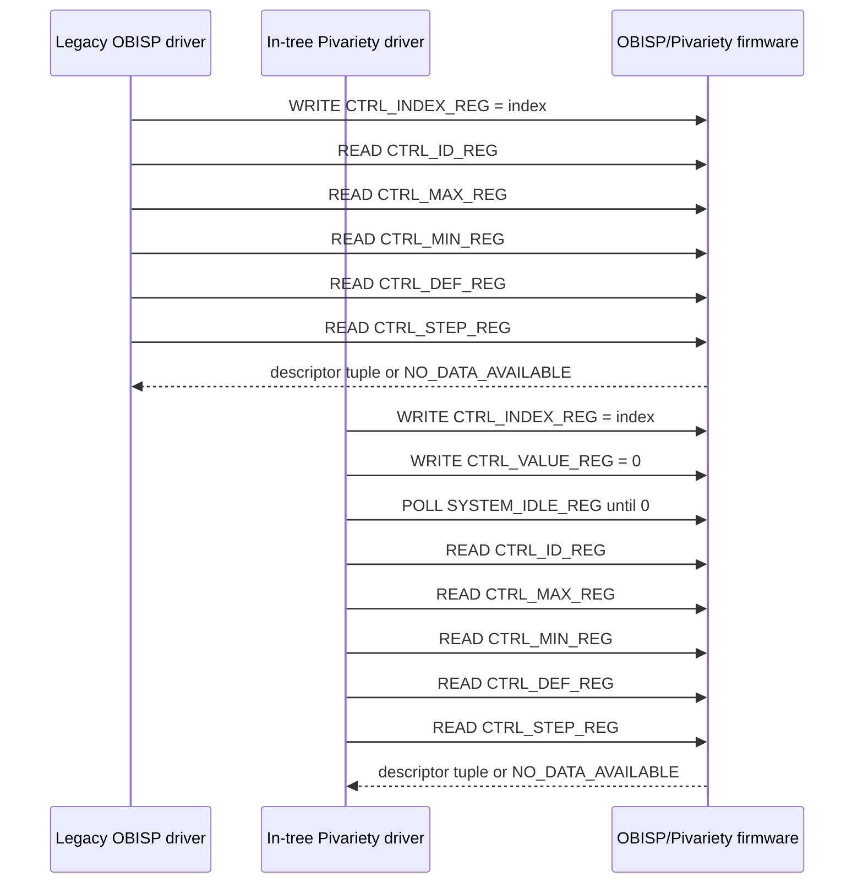

# Arducam Pivariety vs Legacy OBISP Control Enumeration

This note investigates the in-tree Raspberry Pi `arducam-pivariety` driver on branch `rpi-6.12.y` and compares it with this repository's legacy OBISP driver around control enumeration.

External source inspected:

- `https://raw.githubusercontent.com/raspberrypi/linux/rpi-6.12.y/drivers/media/i2c/arducam-pivariety.c`
- `https://raw.githubusercontent.com/raspberrypi/linux/rpi-6.12.y/drivers/media/i2c/arducam-pivariety.h`

## Exact source line printing `enum controls failed`

In the in-tree Raspberry Pi `arducam-pivariety.c`, the message is printed in `pivariety_probe()` after `pivariety_enum_controls(pivariety)` returns non-zero:

```c
if (pivariety_enum_controls(pivariety)) {
        dev_err(dev, "enum controls failed.\n");
        ret = -ENODEV;
        goto error_power_off;
}
```

In the `rpi-6.12.y` source inspected, the exact `dev_err()` line is line 1319.

## Error source traced backwards

The immediate failing function is `pivariety_enum_controls()`. It returns `-ENODEV` at its `err:` label. That label is reached by several paths:

1. `pivariety_get_length_of_set(pivariety, CTRL_INDEX_REG, CTRL_ID_REG)` returns a negative count.
2. Any firmware read/write in the enumeration loop fails, making `ret < 0`.
3. A V4L2 control allocation returns `NULL` after the firmware reports a recognized control ID.
4. `v4l2_fwnode_device_parse()` fails.
5. `v4l2_ctrl_new_fwnode_properties()` fails.

The earliest and most firmware-specific path is the initial length query:

```c
num_ctrls = pivariety_get_length_of_set(pivariety, CTRL_INDEX_REG,
                                        CTRL_ID_REG);
if (num_ctrls < 0)
        goto err;
```

`pivariety_get_length_of_set()` repeatedly writes an index to an index register and reads a value register. If the I2C write or read fails, it returns `-1`; otherwise it stops when the firmware returns `NO_DATA_AVAILABLE` and returns the number of entries discovered.

## Firmware commands sent during Pivariety control enumeration

The Pivariety firmware command/register protocol uses 16-bit logical registers with 32-bit values.

Relevant register definitions in `arducam-pivariety.h` are:

| Name | Value | Meaning in enumeration |
| --- | ---: | --- |
| `CTRL_INDEX_REG` | `0x0400` | Selects which control descriptor the firmware should expose. |
| `CTRL_ID_REG` | `0x0401` | Returns the V4L2/custom control ID for the selected descriptor. |
| `CTRL_MIN_REG` | `0x0402` | Returns the minimum value. |
| `CTRL_MAX_REG` | `0x0403` | Returns the maximum value. |
| `CTRL_STEP_REG` | `0x0404` | Returns the step. |
| `CTRL_DEF_REG` | `0x0405` | Returns the default value. |
| `CTRL_VALUE_REG` | `0x0406` | Used by Pivariety during enumeration to clear/set the current control value. |
| `NO_DATA_AVAILABLE` | `0xFFFFFFFE` | Sentinel indicating no descriptor/value exists for the selected index. |

Control-count discovery sends, for each index starting at 0:

```text
WRITE CTRL_INDEX_REG = index
READ  CTRL_ID_REG
```

Full descriptor enumeration sends, for each index starting at 0:

```text
WRITE CTRL_INDEX_REG = index
WRITE CTRL_VALUE_REG = 0
WAIT  until SYSTEM_IDLE_REG reads idle
READ  CTRL_ID_REG
READ  CTRL_MAX_REG
READ  CTRL_MIN_REG
READ  CTRL_DEF_REG
READ  CTRL_STEP_REG
```

The expected successful response for each valid index is a complete descriptor tuple:

```text
id != NO_DATA_AVAILABLE
max != NO_DATA_AVAILABLE
min != NO_DATA_AVAILABLE
def != NO_DATA_AVAILABLE
step != NO_DATA_AVAILABLE
```

Enumeration terminates normally when any descriptor field in the tuple is the `NO_DATA_AVAILABLE` sentinel. It fails when the transport read/write returns an error or when V4L2/fwnode control creation fails.

## What the legacy OBISP driver does

The legacy OBISP driver performs the same basic indexed firmware descriptor query:

1. It calls `arducam_get_length_of_set(client, CTRL_INDEX_REG, CTRL_ID_REG)`.
2. That helper writes `CTRL_INDEX_REG = index` and reads `CTRL_ID_REG` until it sees `NO_DATA_AVAILABLE`.
3. It initializes the control handler with the discovered count.
4. It loops over indexes, writes `CTRL_INDEX_REG = index`, then reads `CTRL_ID_REG`, `CTRL_MAX_REG`, `CTRL_MIN_REG`, `CTRL_DEF_REG`, and `CTRL_STEP_REG`.
5. It creates either a custom Arducam control or a standard V4L2 control.
6. It resets `CTRL_INDEX_REG` to 0 and returns success.


## Exact side-by-side I2C register transaction sequence

The table below compares the control enumeration protocol for one control index `N`. Both drivers first run the same count-discovery protocol, then enumerate full descriptors.

| Step | Legacy OBISP | Pivariety | Write register | Read register | Expected response |
| ---: | --- | --- | --- | --- | --- |
| 1 | Count discovery: select index `N`. | Count discovery: select index `N`. | Both write `CTRL_INDEX_REG = N` (`0x0400`). | — | I2C write succeeds. |
| 2 | Count discovery: read the selected control ID. | Count discovery: read the selected control ID. | — | Both read `CTRL_ID_REG` (`0x0401`). | A valid control ID means continue counting; `NO_DATA_AVAILABLE` (`0xFFFFFFFE`) means the count is complete. |
| 3 | Count discovery cleanup. | Count discovery cleanup. | Both reset `CTRL_INDEX_REG = 0` (`0x0400`). | — | Write return value is ignored by both implementations. |
| 4 | Descriptor enumeration: select descriptor index `N`. | Descriptor enumeration: select descriptor index `N`. | Both write `CTRL_INDEX_REG = N` (`0x0400`). | — | I2C write succeeds. |
| 5 | **No transaction. This step is absent in legacy OBISP.** | **First protocol difference:** clear/request current control value before descriptor reads. | Pivariety writes `CTRL_VALUE_REG = 0` (`0x0406`). | — | Pivariety expects the write to be accepted; the original source ignores this return code. |
| 6 | **No wait. Legacy immediately reads descriptor fields.** | Wait for firmware to finish the operation triggered in step 5. | — | Pivariety polls `SYSTEM_IDLE_REG` (`0x0107`) through `wait_for_free()`. | Wait exits when `SYSTEM_IDLE_REG` reads `0`; timeout-like exhaustion still returns `0` in the inspected source. |
| 7 | Read descriptor ID. | Read descriptor ID. | — | Both read `CTRL_ID_REG` (`0x0401`). | Valid control ID, or `NO_DATA_AVAILABLE` to terminate enumeration. |
| 8 | Read descriptor maximum. | Read descriptor maximum. | — | Both read `CTRL_MAX_REG` (`0x0403`). | Valid maximum, or `NO_DATA_AVAILABLE` to terminate enumeration. |
| 9 | Read descriptor minimum. | Read descriptor minimum. | — | Both read `CTRL_MIN_REG` (`0x0402`). | Valid minimum, or `NO_DATA_AVAILABLE` to terminate enumeration. |
| 10 | Read descriptor default. | Read descriptor default. | — | Both read `CTRL_DEF_REG` (`0x0405`). | Valid default, or `NO_DATA_AVAILABLE` to terminate enumeration. |
| 11 | Read descriptor step. | Read descriptor step. | — | Both read `CTRL_STEP_REG` (`0x0404`). | Valid step, or `NO_DATA_AVAILABLE` to terminate enumeration. |
| 12 | If any descriptor read/write return is negative, return `-ENODEV`; if any descriptor field is `NO_DATA_AVAILABLE`, stop the loop normally. | Same negative-return and sentinel checks after descriptor reads. | — | — | Valid tuple creates a V4L2 control; sentinel ends descriptor enumeration. |
| 13 | Creates a custom Arducam control if `arducam_ctrl_get_name(id)` is known; otherwise attempts `v4l2_ctrl_new_std()` for the ID. | Creates standard V4L2 controls first, then known Pivariety custom controls; unknown IDs are skipped. | — | — | Control object is registered or skipped depending on ID handling. |
| 14 | Final cleanup after descriptor enumeration. | Final cleanup after descriptor enumeration. | Both reset `CTRL_INDEX_REG = 0` (`0x0400`). | — | Write return value is ignored by legacy; Pivariety source also does not branch on it. |

**First protocol difference:** the first I²C-level protocol difference is step 5. Pivariety writes `CTRL_VALUE_REG = 0` after selecting the control index and before reading descriptor fields. Legacy OBISP does not write `CTRL_VALUE_REG` during enumeration. The next related difference is step 6, where Pivariety polls `SYSTEM_IDLE_REG`; legacy OBISP has no equivalent wait before reading `CTRL_ID_REG`, `CTRL_MAX_REG`, `CTRL_MIN_REG`, `CTRL_DEF_REG`, and `CTRL_STEP_REG`.

## Differences that matter

| Area | In-tree Pivariety | Legacy OBISP in this repository | Impact |
| --- | --- | --- | --- |
| Probe error print | `pivariety_probe()` prints `enum controls failed.` and powers off on failure. | `arducam_probe()` prints the same message and returns `-ENODEV`. | Same observable error string; different cleanup/power path. |
| Count query | Writes `CTRL_INDEX_REG`, reads `CTRL_ID_REG` until `NO_DATA_AVAILABLE`. | Same pattern. | Same firmware contract for discovering the number of controls. |
| Descriptor query | Writes `CTRL_INDEX_REG`, writes `CTRL_VALUE_REG = 0`, waits for firmware idle, then reads ID/max/min/default/step. | Writes `CTRL_INDEX_REG`, then immediately reads ID/max/min/default/step. | Pivariety explicitly clears/synchronizes the firmware state before reading each descriptor; legacy OBISP does not. |
| Firmware busy handling | Calls `wait_for_free()` after writing `CTRL_VALUE_REG = 0`; that polls `SYSTEM_IDLE_REG`. | No equivalent wait in control enumeration. | Pivariety is more robust if descriptor generation is asynchronous or firmware needs settling time. |
| Standard vs custom controls | Uses `v4l2_ctrl_get_name(id)` for standard controls, then `pivariety_ctrl_get_name(id)` for custom controls; unknown IDs are skipped. | Uses `arducam_ctrl_get_name(id)` first for custom controls; otherwise attempts `v4l2_ctrl_new_std()` for every unknown ID. | Legacy OBISP may fail if firmware returns an unknown/non-standard control ID that is not a known Arducam custom ID. |
| NULL control handling | If a recognized control allocation returns `NULL`, immediately fails. | Does not explicitly check each returned pointer before continuing. | Pivariety fails earlier and more explicitly on allocation/ID mismatch. |
| Fwnode controls | Parses fwnode device properties and creates fwnode controls after firmware controls. | Does not add fwnode controls in `arducam_enum_controls()`. | Pivariety can fail after firmware enumeration if Device Tree control-property parsing/creation fails. |
| Handler lock/mutex | Initializes mutex during control enumeration. | Initializes handler but does not set `ctrl_hdlr->lock` in `arducam_enum_controls()`. | Not the likely source of `enum controls failed`, but a registration difference. |

## Legacy operation that is different enough to investigate

The most important behavioral difference is that Pivariety writes `CTRL_VALUE_REG = 0` and waits for `SYSTEM_IDLE_REG` between selecting an index and reading the control descriptor. Legacy OBISP does not do either operation during control enumeration.

If the OBISP firmware used with the legacy driver behaves like newer Pivariety firmware, a direct backport of the Pivariety sequence would mean:

```text
WRITE CTRL_INDEX_REG = index
WRITE CTRL_VALUE_REG = 0
WAIT  SYSTEM_IDLE_REG == 0
READ  CTRL_ID_REG / CTRL_MAX_REG / CTRL_MIN_REG / CTRL_DEF_REG / CTRL_STEP_REG
```

However, the legacy OBISP header in this repository does not define `SYSTEM_IDLE_REG`; the Pivariety header defines it as `DEVICE_REG_BASE | 0x0007`, i.e. `0x0107`. Adding that operation to legacy OBISP would be a behavior change and should only be done after confirming the legacy OBISP firmware implements the same idle register.

## Control enumeration sequence comparison



## Practical interpretation of `enum controls failed`

When the in-tree Pivariety driver logs `enum controls failed.`, the failure does not identify one single firmware command by itself. It means `pivariety_enum_controls()` returned non-zero. The most probable firmware-communication failures are:

- the count-discovery command sequence failed: `WRITE CTRL_INDEX_REG = index`, then `READ CTRL_ID_REG`;
- the descriptor-read command sequence failed after selecting an index;
- the firmware returned a descriptor that led to failed V4L2 control creation.

The difference to check first against the legacy OBISP implementation is the missing legacy `CTRL_VALUE_REG = 0` plus idle wait sequence. Pivariety appears to require that synchronization step before reading each descriptor; legacy OBISP reads descriptor fields immediately after selecting the index.
